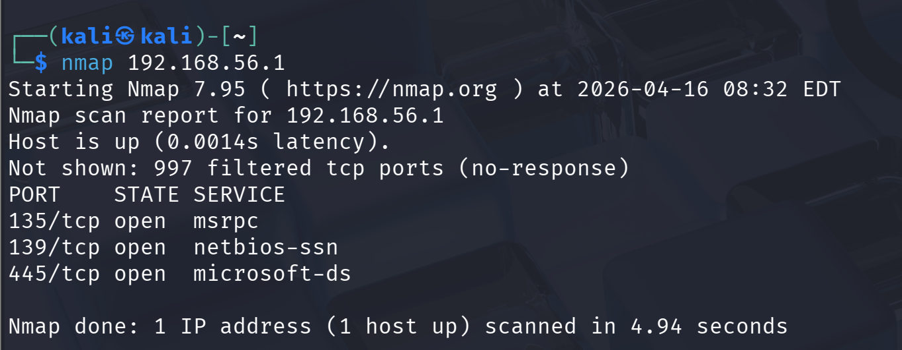
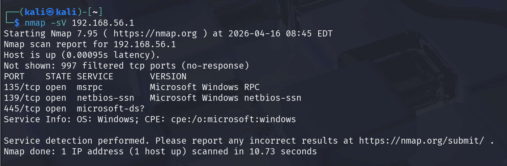
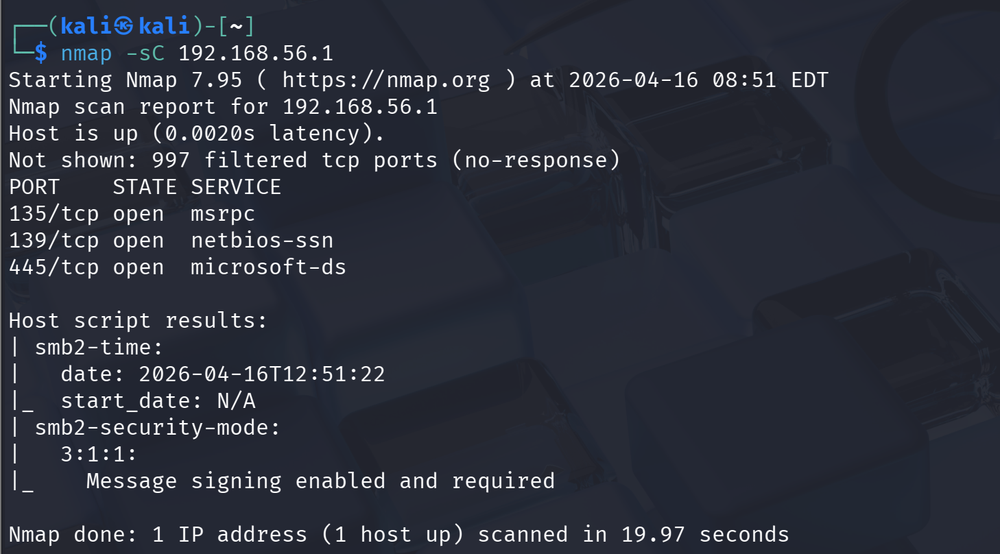

# Basic Network Security Assessment using Nmap

## Overview
# Network Security Assessment using Nmap

This project demonstrates a practical network security assessment using Nmap, focusing on service enumeration, SMB analysis, and basic vulnerability evaluation in a controlled lab environment.

---

## Objectives
- Identify open ports
- Detect running services
- Analyze security configurations
- Check for potential vulnerabilities

---

## Tools Used
- Nmap
- Kali Linux

---

## Methodology
The following steps were performed:

1. Basic Port Scan  
2. Service Version Detection  
3. Default Script Scanning  
4. SMB Enumeration  
5. Vulnerability Scanning  

---

## Key Findings

### Open Ports
- 135 (Microsoft Remote Procedure Call)
- 139 (NetBIOS Session Service)
- 445 (Server Message Block - SMB)

---

### System Analysis
The target appears to be a Windows-based system based on detected services.

---

### Security Observations
- Majority of ports are filtered, indicating firewall protection
- SMB requires authentication
- Message signing is enabled and enforced
- No anonymous access allowed

---

### Vulnerability Scan
- No confirmed vulnerabilities found
- Some checks could not be completed due to access restrictions

---

## Screenshots

---

## Detailed Report

See full report here: [View Report](network-security-report.md )

Download PDF version: [Download Report](Basic Network Security Assessment using Nmap.pdf)

---

## Conclusion
The system appears relatively secure based on the performed assessment.  
Security controls such as authentication and message signing are properly implemented.

---

## Future Improvements
- Perform authenticated scanning
- Conduct deeper vulnerability analysis
- Expand to additional network services

## Disclaimer

This project was conducted in a controlled lab environment for educational purposes only. No unauthorized systems were targeted.
